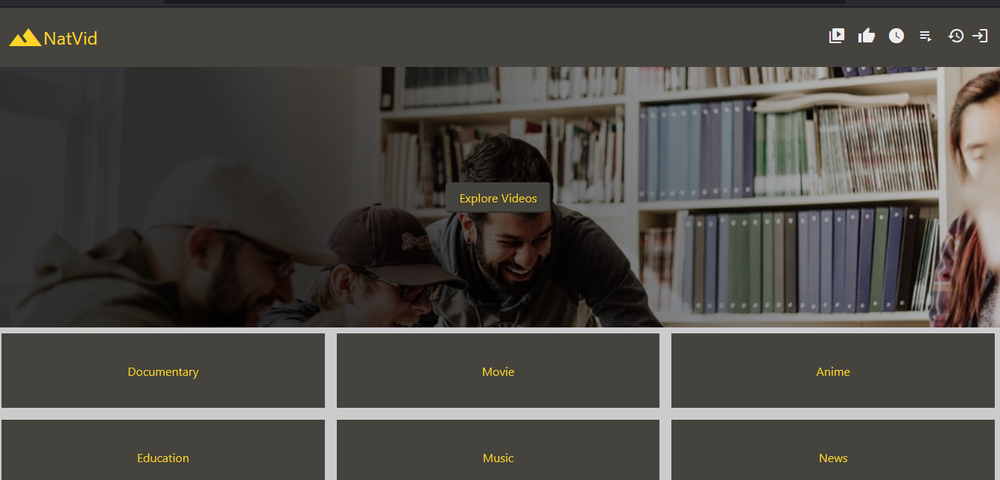
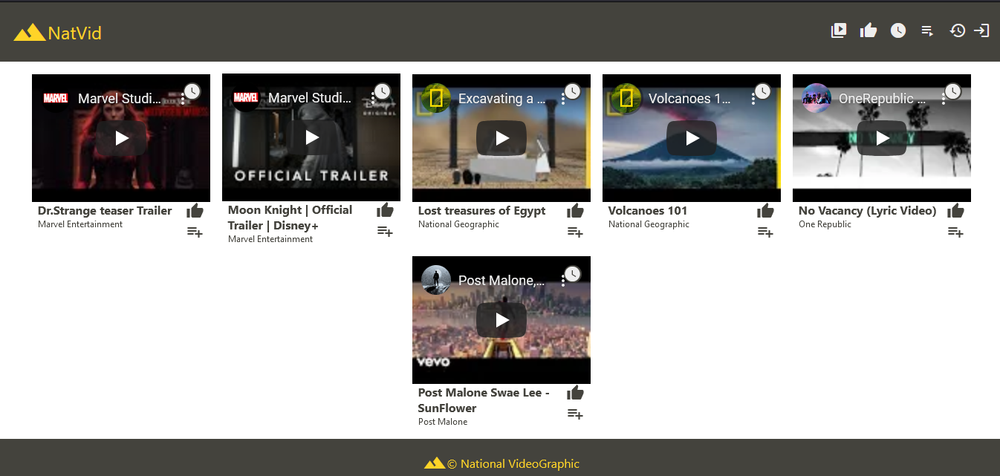
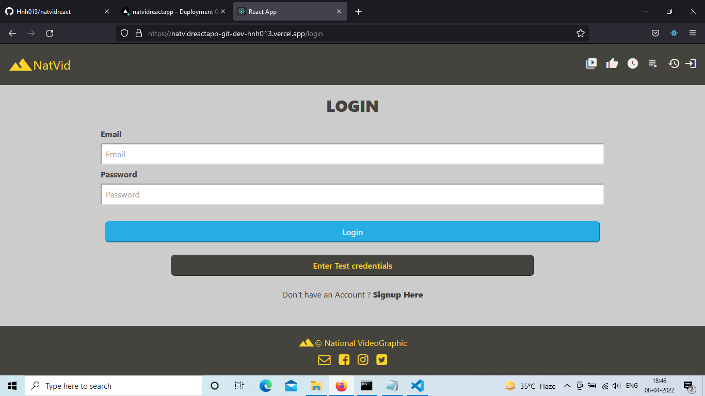
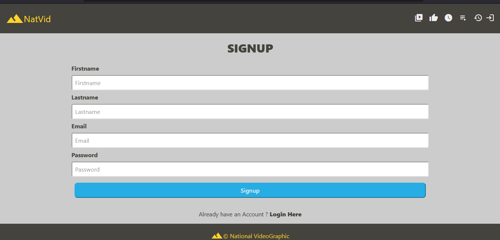
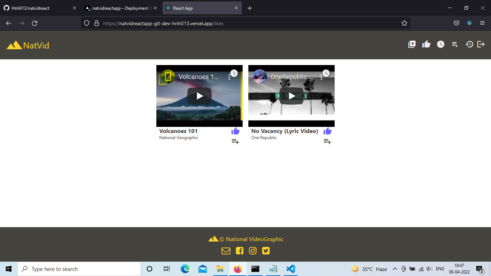
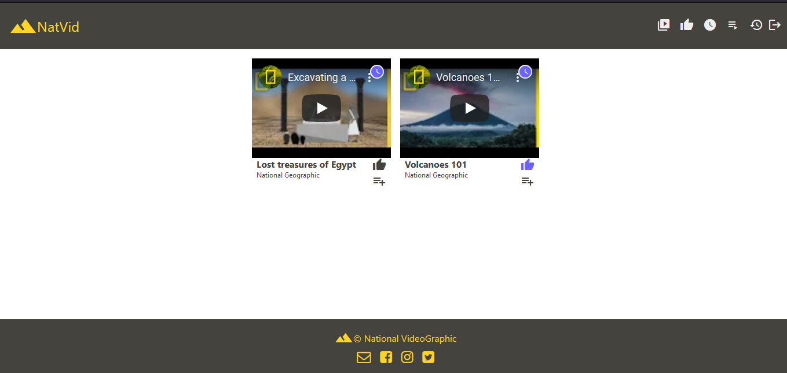
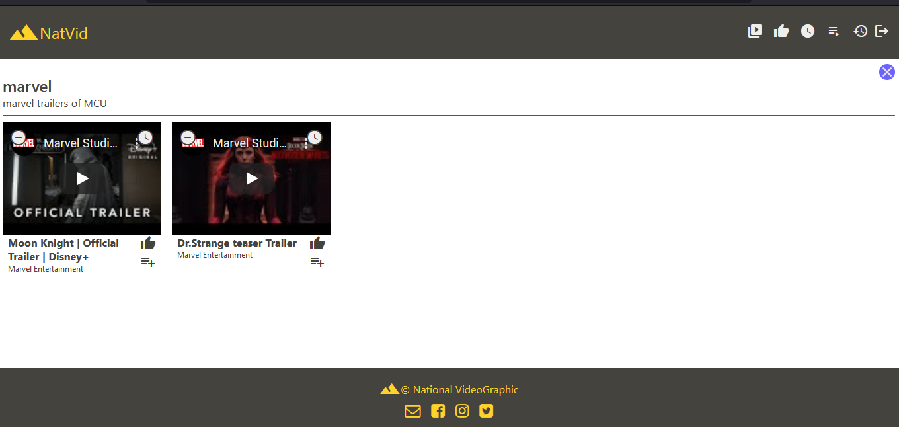
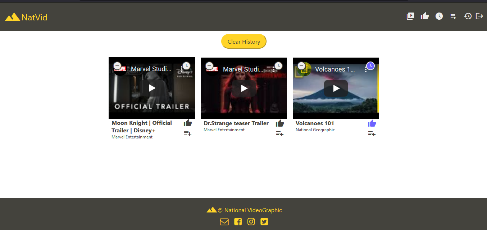

# NatVid (NationalVidepgraphic) : A video Library

### Disclaimer

The current application is still a WIP (work in progress) , but the intended functionalities added upto this point work in the intended manner.     
(Note : Do not refresh the page while using the website , as it is still a WIP and can braeak features , be patient!).      
At current stage pages with React JS along with HTML & CSS have been developed.     

### The project is live at
#### Vercel : https://natvidreactapp-git-dev-hnh013.vercel.app/

## Contents

1. **[Project Title & description](#theSoleStore)**
2. **[Purpose of the project](#purpose-of-the-project)**
3. **[Technologies Used](#technologies-used)**
4. **[Motivations behind the project](#motivations-behind-the-project)**
5. **[Demo](#demo)**

## 1. NatVid 
* The NatVid is a video-library website where users can watch videos form all over the world by different channels and creators. 
* The application will offer its users to consume video content from a variety of categories.   
* Users would be able to like a video , save it to watch later and group together their favorite set of videos by creating a playlist.
* Users will be able to login , signup an logout of the application.

At this moment, current list of components/pages that are present in the application are :

1. Home Page [Link](https://natvidreactapp-git-dev-hnh013.vercel.app/)
2. Videos Page [Link](https://natvidreactapp-git-dev-hnh013.vercel.app/videos)
3. Login Page [Link](https://natvidreactapp-git-dev-hnh013.vercel.app/login)
4. Signup Page [Link](https://natvidreactapp-git-dev-hnh013.vercel.app/signup)     
    (Protected Routes , user needs to login to access)
5. Liked Videos Page [Link](https://natvidreactapp-git-dev-hnh013.vercel.app/likes) 
6. Watch Later Page [Link](https://natvidreactapp-git-dev-hnh013.vercel.app/watchlater)
7. Playlists Page [Link](https://natvidreactapp-git-dev-hnh013.vercel.app/playlists)
8. History Page [Link](https://natvidreactapp-git-dev-hnh013.vercel.app/history)

## 2. Purpose of the project
* The main aim of the project is to create a user-friendly, easily to navigate video library where users can watch a wide variety of videos and can do much more.
* The user should be able to add to navigate the landing page and see the categories of the videos in the store.
* The user should be able to see the list of videos present in the video library.
* The user should be able to log in and out of the site , with notification (in form of toasts) giving the status of their persistence.
* The user should be able to signup , creating a new account if he/she doesn't possesses one.
* The user , if logged in , should be able to like or unlike a video , save it to watch later and then remove it from watch later. 
* The user , if logged in , should be able to create playlists to group their favorite videos together.
* The user , if logged in , should be able to track their history of wacthed videos from history page and able to clear it.

## 3. Technologies Used
* At the current stage of development, HTML , CSS and ReactJS have been used in the project.

## 4. Motivations behind the project
* This project was built as part of my learning of ReactJS , HTML and CSS in neogcamp 2022.
* The project was as an video-library website , where users can watch videos , like , save for later , and create playlists of their favorite videos.

## 5. Demo

### The project is live at
#### Vercel : https://natvidreactapp-git-dev-hnh013.vercel.app/

#### Home Page [Link](https://natvidreactapp-git-dev-hnh013.vercel.app/)

#### Videos Page [Link](https://natvidreactapp-git-dev-hnh013.vercel.app/videos)

#### Login Page [Link](https://natvidreactapp-git-dev-hnh013.vercel.app/login)

#### Signup Page [Link](https://natvidreactapp-git-dev-hnh013.vercel.app/signup)

#### Liked Videos Page (protected route, needs login) [Link](https://natvidreactapp-git-dev-hnh013.vercel.app/likes)

#### Watch Later Page (protected route, needs login) [Link](https://natvidreactapp-git-dev-hnh013.vercel.app/watchlater)

#### Playlists Page (protected route, needs login) [Link](https://natvidreactapp-git-dev-hnh013.vercel.app/playlists)

#### History Page (protected route, needs login) [Link](https://natvidreactapp-git-dev-hnh013.vercel.app/history)

[Back To Top](#top)
